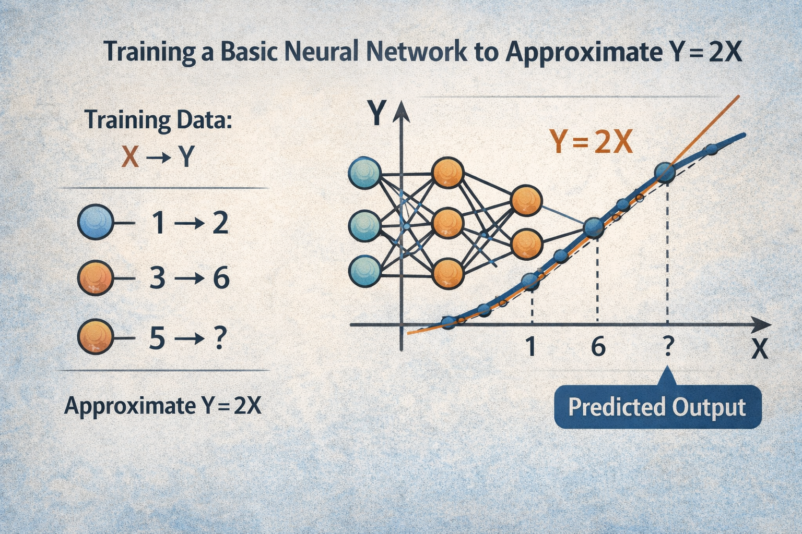

## Understanding Neural Networks as Functions

Talking about neural networks quickly leads to debates about “intelligence,” “understanding,” or “reasoning.” Many of those discussions become confusing because they start from the wrong intuition about what a neural network actually is and what kind of problem it is solving.

A clearer—and more useful—way to think about them is as approximators of unknown functions. From that perspective, their capabilities and limits stop being mysterious and become direct consequences of the function they are trying to approximate and the data available to do so.

## 1. The Neural Network as an Approximation of an Unknown Function

A neural network does not “learn rules” or “discover truths”; it learns to approximate a function from examples.

### Minimal Example

Consider the simplest possible case. There is a mathematical function **Y = 2X**. We never tell the network what the formula is; we only provide samples:

| X   | 1   | 2   | 3   | 4   |
| --- | --- | --- | --- | --- |
| Y   | 2   | 4   | 6   | 8   |

We train a basic neural network (a single layer, a few parameters) so that, given a value of **X**, it produces a **Y** that is as close as possible to the expected outcome.

#### What is happening internally?

- The network starts as a set of random numbers (parameters).
- The trainer inputs **X** and receives a number.
- The received value (random at the beginning) is compared to known **Y**.
- After that an algorithm iterates through all the parameters, adjusting them only slightly to get them just a little closer to the expected value.
- This is repeated many times, so the parameters get closer and closer to the known **Y**.

At this point, we have a secret: we keep another set of correct **X-Y** that we don't use to train the model (the testing set).

At regular intervals during training, we test these saved values, and if the model's response is correct, then it has **generalized**.

This means that internally, the set of parameters, when processed by the inference operations, generates a function that approximates the original.

This means that the model can not only provide answers for the number pairs it was trained on but can also give very close approximations for all the other numbers it has never seen.

#### What This Example Teaches

- There is a real function (known or unknown).
- There are data points sampling that function.
- The network learns an approximation, not the exact function.

Everything else—depth, attention, transformers—is a matter of scale and of the complexity of the target function.

## 2. Scaling Hypothesis vs. Paradigm-Driven: What Function Do LLMs Approximate?

When we move from **Y = 2X** to language models, the key question is not how they learn but which function they are trying to approximate.

### The Scaling Hypothesis

The scaling hypothesis argues that, given a sufficiently large and well-curated corpus, plus enough parameters and training time, the model ends up approximating the entire function of human reasoning. From this perspective:

- Human text is a noisy yet valid sample of thought.
- Reasoning, logic, creativity, and even planning are implicit in language.
- Scaling data and parameters essentially scales the fidelity of the approximation.

Under this hypothesis, nothing fundamental is missing—only more data, more compute, and better architectures.

### The Paradigm-Driven Approach

The paradigm-driven approach disagrees on a central point: language is not the function, but a partial projection of it. The core thesis is that:

- Thought cannot be reduced to linguistic correlations.
- Human text lacks key metadata: explicit causality, objectives, internal states, systematic errors.
- Approximating the “true” function of thought requires other signals: algorithmic traces, simulations, interactive environments, structured feedback.

From this point of view, current LLMs approximate a function very well, but not necessarily the function we have in mind.

## 3. Limits… and Beyond

If a model is trained exclusively on human-generated data, the function it approximates can only be a human-subjective representation of the world. That is its fundamental limit.

#### Q: Which Human, Exactly?

Not one in particular, but the statistical sum of millions of humans who produced the corpus. That is why a model can:

- Write better than most people.
- Recall more facts than any individual.
- Combine styles, ideas, and approaches in ways that surpass a single person.

Even so, it remains a subjective function: it inherits biases, conceptual errors, and human cognitive shortcuts. Quantitative advantage does not remove qualitative limitation.

#### Changing the Objective Function

This is where reinforcement comes in. In tasks where the quality of an answer can be measured objectively (code, chess, maths), training can stop approximating "what humans say" and start approximating the function of the thing itself.

##### The Chess Example

- Human language describes strategies, principles, and heuristics.
- But the real function is: given a position, what is the best move?

Reinforcement allows the model to optimize directly against that function, bypassing human subjectivity. With reinforcement learning—especially adversarial variants—the corpus stops being static. The model generates data, faces its own limits, and corrects its approximation based on measurable results, not human opinions.

At that point something crucial happens: the model is no longer limited by how we think about the problem; it starts approximating how the problem actually is. That is when models not only surpass individuals but collectively surpass our intuitions.

## Closing Thoughts

Seeing neural networks as function approximators does not make them less impressive; it makes them more understandable. Their capabilities are not magical, and their limits are not accidental. Everything depends on:

- Which function they are trying to approximate.
- Which data define that function.
- Which signal we use to tell them whether they are getting closer or farther away.

Understanding this does not answer every question about the future of AI, but it clarifies a fundamental one: when a model “fails,” it is rarely because it is not large enough—it is because it is approximating exactly the function we asked for, even if that is not the one we actually wanted.

## Beyond

There is much more to explore, but it is left to the reader to consider these questions, such as:

Is it capable of making a scientific discovery? - Yes, since it can combine knowledge from many areas that no single human being was able to learn in a lifetime and can interpolate this knowledge.

Is it capable of extrapolating? The problem here is that an LLM approximates a function of many dimensions, so the concept of extrapolation and interpolation becomes blurred.

Are we capable of extrapolating, or is all human discovery merely interpolation? Who knows?
